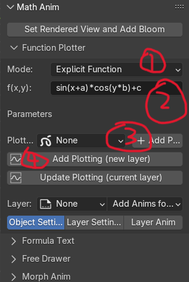

<div align="center">

# Blender3D Math Animation Addon 

</div>

Inspired by [3Blue1Brown Manim](https://github.com/3b1b/manim) for science explainatory, I create this 
tool for the same purpose based on Blender which is much fancier and more powerful to unlock your 
creativity. It is very intuitive to use for those who don't have code based skills. If you are familiar 
with Blender, the unleashing power will enable you amaze the world.

## Overview
The main purpose of this addon is to provide an easy and straightfoward but powerful and fancy tool to make 
scientific knowledge animations, especially for math and physics etc. To make it lightweight, I choose the Grease 
Pencil system; another reason is that it's native to Drawing which makes it perfect choice to add drawing 
functionality. 

The math function plotting is pretty fast unless you give too much resolution. Explicit, parametric and polar 
functions are supported. It automatically detects variables and parameters with live update when their values 
change. The supported math functions come with the `asteval` package, which can be checked by 
`asteval.Interpreter().symtable.keys()` after `import asteval` in the python console.

The math formula typeset is extracted from compiled PDF, and then arrange them using Geometry Nodes char by char. 
A lot of Geometry nodes will be used if you have many chars, so this part can be slow. It supports PDF directly or 
you can type [Typst](https://github.com/typst/typst) or [Optex](https://github.com/olsak/OpTeX)(Latex) code or 
upload files, it will automatically compile them to PDF. To make things easier, only modern `.ttf` and `.otf` fonts 
are supported, the outdated Latex fonts like afm, pfm are not supported, that's why I limit the Latex engine to 
Optex. You can use LuaLaTex or XeLatex with `.otf` or `.ttf` fonts configured to compile to PDF for the addon to 
use. The addon **Preference** will build all available fonts dictionary once you provide the fonts' path.

The Drawing function enables you express your ideas freely by drawing or hand writing. With drawing tablet or iPad 
you can do anything.

The preset animations can be used across all parts and it's easy to extend or add your own if you're are familiar 
with Geometry Nodes. Of course, all things can be keyframed to animate which is super super super easy. Last, you 
can morph between or across plots, texts and drawings which is super cool.

The decision to choose Grease Pencil as the carrier of plots, texts and drawings mainly because it is lightweight, 
better for morph animations, but the cons are obvious, it is not as fancy as mesh in 3D scenes, especially for 
overlapping, the fill is not working correctly in 3D rendering yet. Hopefully, Blender can improve it with time. 
<!--
There are some awesome existing tools and addons, like [blender\_typst\_importer](https://github.com/kolibril13/blender_typst_importer) to help people, but they all lack deep features like predefined animations and single 
function orientation. Tool like [Manim](https://github.com/3b1b/manim) is very good, but it's still require 
efforts to learn code and could take quite some time to achieve what your want. 
-->

## Features
- Fast function plotting and animation, support explicit, parametric and polar functions. Automatically detect 
  variables and parameters. Same parameters can be used across different functions and do the controls. 
- Support different ways to compile math formula, Typst, Latex(Optex) and PDF. Easy preset animations to config.
- Support free drawing and writting.
- Morph Animation works among all types, between and across plotting, text, free drawing.
- Super esay to extend and add your own animations 
- Cool visual effects including Bloom, Glow, Rim, Shadow, etc...

## Installation And Setup
Before installation:
- [Typst](https://github.com/typst/typst) as a python package is shipped with the the addon, but you'd better have 
  it in your system to test the fonts.
    - `typst fonts` will list available fonts for `Typst` use.
- You need to install Latex [Optex](https://github.com/olsak/OpTeX?tab=readme-ov-file) package if you plan to use 
  it. Then install fonts you will use.
    - It will automatically download fonts when you setup in your tex file, for example, save the following code 
      to op-demo.tex and run `optex op-demo.tex`, it will automatically download the `stix` font. 
      ```bash
      \fontfam[stix] %new computer modern, lmfonts, stix, xits, xtixtwo, dejavu
      \nopagenumbers
      $$
      e^\alpha \sum_{k=0}^\infty (\cos\beta_k + i\sin\beta_k)\sqrt{2}\int_{-\infty}^{\infty}dx\mbffraka
      $$
      \bye
      ```
    - Recommend to download all the list fonts. Available [Optex fonts](https://petr.olsak.net/ftp/olsak/optex/op-catalog.pdf)

Now:
- `Edit -> Preference -> Get Extensions -> Install from Disk...`, locate the zip file to install.
- After installation, click `Add-ons` and find `Math Anim` which is this addon, and open the panel go to lower, you 
  need to add the font paths to build fonts' library, only `.otf` and `.ttf` fonts are used. You need to add the 
  Typst and Latex font paths if you plan to use them.
- Optional, you can give presets of Optex or Typst which is helpful for later use, if empty, they will not show 
  up in the addon UI.
- You also can set the N Panel Location of the addon UI, it will take effect after reopen. Default it's under Tool
  category which is better if you use Drawing cause in Draw Mode some convenient tools are available there.
- You're ready to use.

## Usage
### 1. Function Plotter 
1. Select the function mode. 
2. Type the function, hit `Enter`. 
   - Adjust variables' ranges and parameters' values.
3. Choose a plotter object, or you can create one by `Add Plotter` button if there is none.
4. Add a plotting by `Add plotting` button. 
5. Further adjust the plotting's properties, like variables's ranges, parameters' values, color, thickness, etc. 
And you can add preset animations to the plotting.

| Function Plot | With Plotting |
|---------|---------|
|  |  |

### 2. Formula Text
1. Select the formula source.
2. Type the formula and hit `Enter` or upload the file. Click `Create Formula` button to get the formula.
3. Adjust the formula's properties, like color, thickness, etc. And you can add preset animations to the formula.
### 3. Free Drawer
1. Select a drawing object or you create one by `Add Drawer` button if there is none.
2. Select the drawing layer; click `Draw Mode`, start to draw; click again after drawing is done to go back normal mode.
3. Adjust the drawing's properties, like color, thickness, etc. And you can add preset animations to the drawing.
### 4. Morph Anim
1. Click `Morph Setup` button to config the morph animations.
2. In the popup window, select the source and target objects, and choose the morph type.
3. Config the Morph chain, click `OK` button to add morph animations.
4. Adjust the morphing properties.

Check my tutorials for detailed explanation.

## Bug Report
Use **Issues** to report bugs. 

